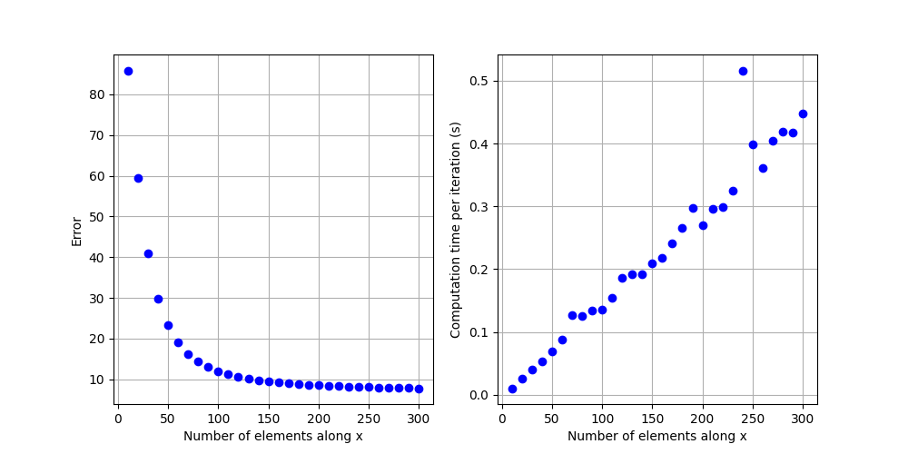
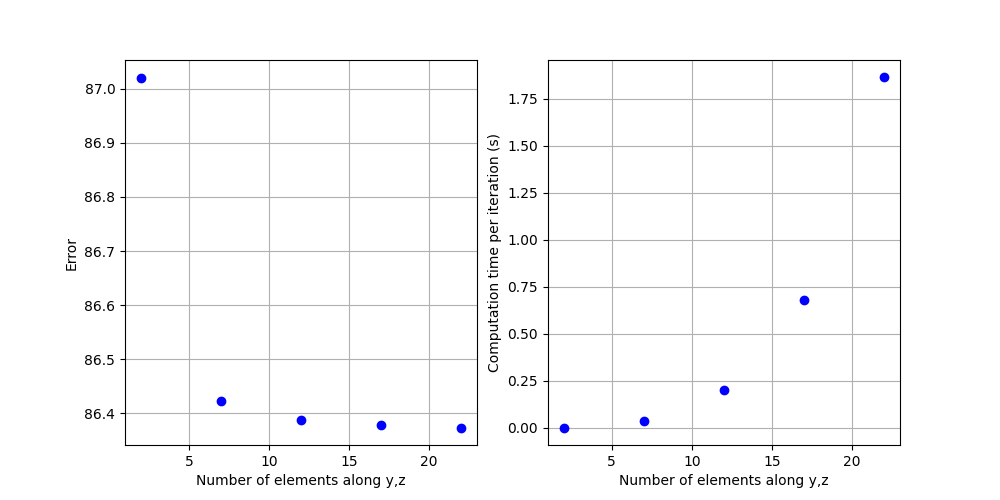

# Cantilever beam

### Description

A cantilever beam is a beam, so an elastic body at least 10 times longer in one direction than the others, which is clamped at one end. In this scenario, we consider a force to be applied at the tip of the beam. We investigate how the mesh density influence the accuracy and computation time of the model.

### Groundtruth

Could be analytical (mention the assumptions and equations), numerical (mention the algorithms, git repo, or database where the data are stored) or experimental (mention the database where the data are stored)

Type: Analytical

Assumptions:
* Beam assumptions: slender elastic body that can be defined by a centerline and composed of of non-deformable cross-sections
* The beam position is fixed at (0,0) at the base
* A force with a constant orientation and magnitude is applied at the tip
* The deformations are small: the non-linearities due to the beam orientation are negligible 
* The beam is incompressible
* The material is isotropic, linear and elastic

Equations:

We assume the beam deforms in the $(x,z)$ plane and is aligned with the $x$ axis at rest. For a tip force in the $(0,-1)$ direction, the vertical displacement at the tip $\Delta p_z$ of the beam is:
$$ \Delta p_z = \frac{F L^3}{3 E I} = 1.28 mm $$
where:
* $F$ is the tip force magnitude in N
* $L$ is the beam length in m
* $E$ is the Young's modulus of the beam material in Pa
* $I$ is the second moment of area of the beam's cross section in m $^4$. A square cross-section of side $r$ is considered, giving $I=r^4/12$

Parameters:
| Variable | Nominal value|
| ------ | -------|
| $E$ |  50 MPa |
| $F$ | 0.01 N |
| $r$ | 5 mm |
| $L$ | 100 mm |

## Test scene 1: Co-rotationnal FEM with tetrahedron elements

### Scene

Description:

Describe the scene, how the mesh is generated and the link with the mesh density, and the elements allowing the error to be computed, here the mapped point at the tip of the beam.

Error metrics:

$$ \epsilon = 100.0*\frac{\left| \Delta p_z - \tilde{\Delta p_z} \right|}{\left|\tilde{\Delta p_z} \right|}  $$

where:
* $\tilde{\Delta p_z}$ is the vertical displacement of the mapped point at the beam tip obtained in simulation 

### Results

