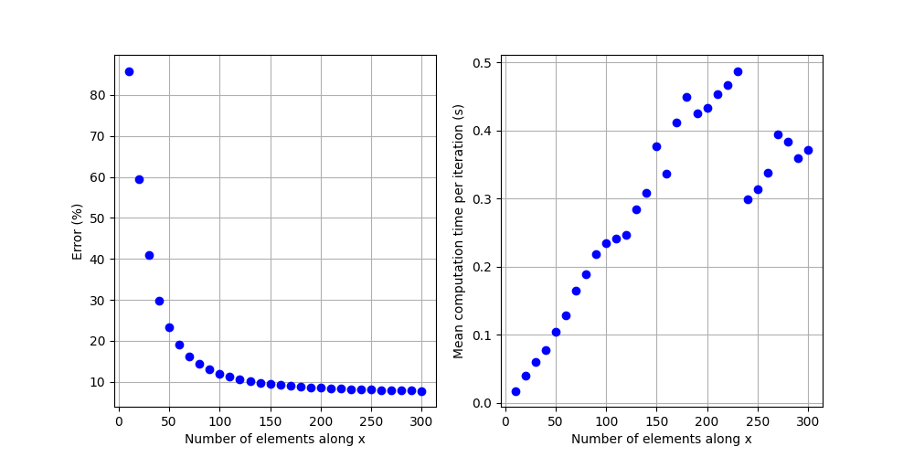
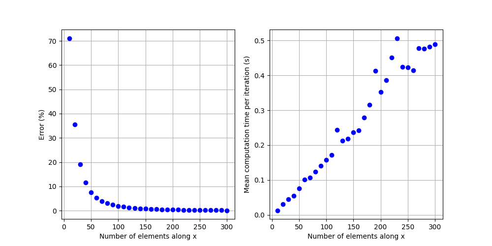
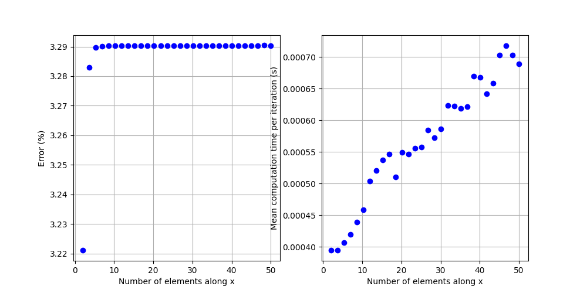
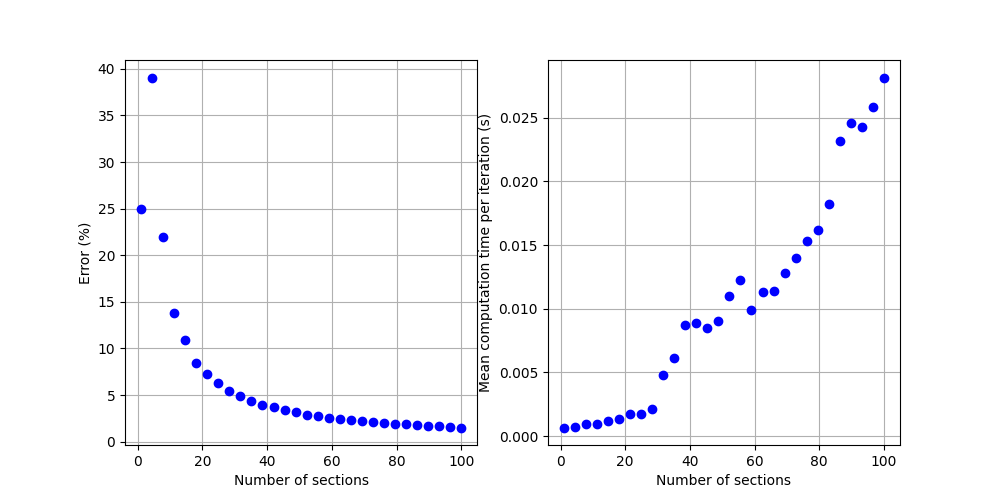
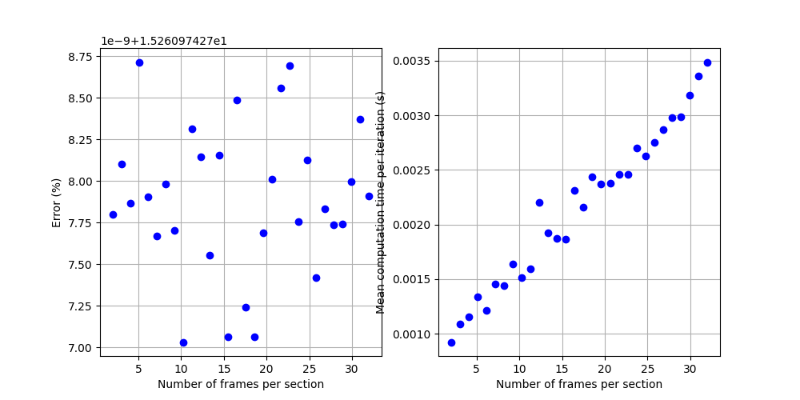

# Cantilever beam

### Description

A cantilever beam is a beam, so an elastic body at least 10 times longer in one direction than the others, which is clamped at one end. In this scenario, we consider a force to be applied at the tip of the beam. We investigate how the mesh density influence the accuracy and computation time of the model.

### Groundtruth

Could be analytical (mention the assumptions and equations), numerical (mention the algorithms, git repo, or database where the data are stored) or experimental (mention the database where the data are stored)

**Type:** Analytical

**Assumptions:**
* Beam assumptions: slender elastic body that can be defined by a centerline and composed of of non-deformable cross-sections
* The beam position is fixed at (0,0) at the base
* A force with a constant orientation and magnitude is applied at the tip
* The deformations are small: the non-linearities due to the beam orientation are negligible 
* The beam is incompressible
* The material is isotropic, linear and elastic

**Equations:**

We assume the beam deforms in the $(x,z)$ plane and is aligned with the $x$ axis at rest. For a tip force in the $(0,-1)$ direction, the vertical displacement at the tip $\Delta p_z$ of the beam is:
$$ \Delta p_z = \frac{F L^3}{3 E I} = 1.28 mm $$
where:
* $F$ is the tip force magnitude in N
* $L$ is the beam length in m
* $E$ is the Young's modulus of the beam material in Pa
* $I$ is the second moment of area of the beam's cross section in m $^4$. A square cross-section of side $r$ is considered, giving $I=r^4/12$

**Parameters:**
| Variable | Nominal value|
| ------ | -------|
| $E$ |  50 MPa |
| $F$ | 0.01 N |
| $r$ | 5 mm |
| $L$ | 100 mm |

**Error metrics:**

$$ \epsilon = 100.0*\frac{\left| \Delta p_z - \tilde{\Delta p_z} \right|}{\left|\tilde{\Delta p_z} \right|}  $$

where:
* $\tilde{\Delta p_z}$ is the vertical displacement of the mapped point at the beam tip obtained in simulation 

## Test scene 1: Co-rotationnal FEM with tetrahedron elements

### Scene description

**Base attachment:** 

Selection of all the nodes in the cross-section at the beam's base and application of a projective fixing constraint (FixedProjectiveConstraint)

**Elastic deformations:** 

Beam with square cross-section. The mesh is generated with a RegularGridTopology, and converted in a tetrahedral mesh with the Hexa2TetraTopologicalMapping. The number of elements along the beam length (x axis) and in the cross section (along y and z axis) can therefore be defined. Linear elasticity is added with a TetrahedronFEMForceField. The co-rotational model is selected with the option method = 'large'. The Poisson ratio is set to 0.0 to enforce the elements just elongate along the neutral fiber and do not deform in the other directions, as the beam cross-section must be constant. 

**Force application:** 

A ConstantForceField is applied with a total force in the negative z axis direction, on aall the node belonging to the cross-section at the tip of the beam. 

**Tip position computation:**

A single point is added at the tip location of the beam's neutral axis and is linked to the mesh using a BarycentricMapping. The displacement of this point along the z axis is taken as the beam deflection $\tilde{\Delta p_z}$.

### Parameters

| Variable | Nominal value| Min value | Max value |
| -------| -------| -------| -------| 
| Number of elements along x |  10 | 10 | 300 |
| Number of elements along y and z | 5 | 2 | 22 |

### Results

### PC specifications

Model: HP HP EliteBook x360 1040 G8 Notebook PC

CPU: 11th Gen Intel® Core™ i7-1185G7 @ 3.00GHz × 8

RAM: 16 GB

## Test scene 2: Co-rotationnal FEM with hexahedron elements

### Scene description

**Base attachment:** 

Selection of all the nodes in the cross-section at the beam's base and application of a projective fixing constraint (FixedProjectiveConstraint)

**Elastic deformations:** 

Beam with square cross-section. The mesh is generated with a RegularGridTopology. The number of elements along the beam length (x axis) and in the cross section (along y and z axis) can therefore be defined. Linear elasticity is added with a HexahedronFEMForceField. The co-rotational model is selected with the option method = 'large'. The Poisson ratio is set to 0.0 to enforce the elements just elongate along the neutral fiber and do not deform in the other directions, as the beam cross-section must be constant. 

**Force application:** 

A ConstantForceField is applied with a total force in the negative z axis direction, on aall the node belonging to the cross-section at the tip of the beam. 

**Tip position computation:**

A single point is added at the tip location of the beam's neutral axis and is linked to the mesh using a BarycentricMapping. The displacement of this point along the z axis is taken as the beam deflection $\tilde{\Delta p_z}$.

### Parameters

| Variable | Nominal value| Min value | Max value |
| -------| -------| -------| -------| 
| Number of elements along x |  10 | 10 | 300 |
| Number of elements along y and z | 5 | 2 | 22 |

### Results

### PC specifications

Model: HP HP EliteBook x360 1040 G8 Notebook PC

CPU: 11th Gen Intel® Core™ i7-1185G7 @ 3.00GHz × 8

RAM: 16 GB

## Test scene 3: Co-rotational FEM with 1D beam elements

### Scene description

**Base attachment:** 

Selection of the node at the beam's base and application of a projective fixing constraint (FixedProjectiveConstraint)

**Elastic deformations:** 

Beam with square cross-section. The 1D mesh is generated with a RegularGridTopology. The number of elements along the beam length (x axis) can therefore be defined. Linear elasticity is added with a BeamInterpolation and AdaptiveBeamForceFieldAndMass. The Poisson ratio is set to 0.0.

**Force application:** 

A ConstantForceField is applied with a total force in the negative z axis direction, on the node at the tip of the beam. 

**Tip position computation:**

The tip location is taken as the position of the last node of the 1D mesh. The displacement of this point along the z axis is taken as the beam deflection $\tilde{\Delta p_z}$.

### Parameters

| Variable | Nominal value| Min value | Max value |
| -------| -------| -------| -------| 
| Number of elements along x |  2 | 50 | 30 |

### Results

### PC specifications

Model: HP HP EliteBook x360 1040 G8 Notebook PC

CPU: 11th Gen Intel® Core™ i7-1185G7 @ 3.00GHz × 8

RAM: 16 GB

## Test scene 4: Constant strain Cosserat elements

### Scene description

**Base attachment:** 

Selection of the node at the beam's base and application of a projective fixing constraint (FixedProjectiveConstraint)

**Elastic deformations:** 

Beam with square cross-section. The beam is discretized in $N_s$ sections with constant bending and torsion strains. Extension and shear are not allowed. This is enforced by defining the strain state of the Cosserat rod with a Vec3 template. Linear elasticity is added to this state with a BeamHookeLawForceField. he Poisson ratio is set to 0.0. The 1D mesh corresponding to the beam position and orientation is generated with a RegularGridTopology. The number of elements along the beam length (x axis) can therefore be defined. It is linked to the strain state with a DiscreteCosseratMapping.

**Force application:** 

A ConstantForceField is applied with a total force in the negative z axis direction, on the node at the tip of the beam. 

**Tip position computation:**

The tip location is taken as the position of the last node of the 1D mesh. The displacement of this point along the z axis is taken as the beam deflection $\tilde{\Delta p_z}$.

### Parameters

| Variable | Nominal value| Min value | Max value |
| -------| -------| -------| -------| 
| Number of sections |  2 | 2 | 30 |
| Number of frames per section |  2 | 1 | 30 |

### Results

### PC specifications

Model: HP HP EliteBook x360 1040 G8 Notebook PC

CPU: 11th Gen Intel® Core™ i7-1185G7 @ 3.00GHz × 8

RAM: 16 GB
